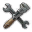
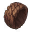
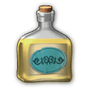
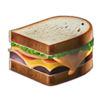
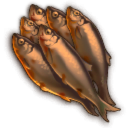

# Shared Mod Resources

Important: Do not include modified versions of shared resources in your mod.
You will break other mods by that.

Propose changes here instead.

## How to use

### Manual

Download a release, extract the mod you want into your own mod.

### Automatic

Add a `bundle` to you `modinfo.json` and use the `F1`/right-click action `Build and Deploy Mod` of the [Anno Modding Tools](https://marketplace.visualstudio.com/items?itemName=JakobHarder.anno-modding-tools) extension in [VS Code](https://code.visualstudio.com/).

```json
"bundle": [
  "https://github.com/anno-mods/shared-resources/releases/download/v3/shared-pools-and-definitions.zip"
],
```

## Pools and Definitions

`[Shared] Pools and Definitions`, ModID: `shared-pools-and-definitions`

- Shared pools like "All Sand Mines" to allow multiple mods using the same new pools.
- Hotel needs for compatibility with New World Tourism

## Ground Textures

`[Shared] Ground Textures City (Jakob)`, ModID: `shared-ground-textures-city-jakob`
- City: Engineer/Investor like pavements.

`[Shared] Ground Textures Industry (Jakob)`, ModID: `shared-ground-textures-industry-jakob`

- Industry: Concrete/stone pavement for industries.

## Shared Products

`[Shared] Products (Jakob)`, ModID: `shared-products-jakob`


Icon | GUID | Name | Product Unlock
---|---|---|---
 | 1500010836 | Vegetables | Workers
 | 1500010120 | Canned Fish | Artisans
 | 1500010102 | Cheese | Artisans
 | 1500010153 | Tools | Artisans
 | 1440224 | Hemp | Artisans
 | 1500010127 | Suits | Artisans
 | 1500010847 | Tea | Engineers
 | 1404420032 | Apples | Farmer
 | 1500010150 | Wooden Jewelry | Farmer
 | 1500301073 | Coloured Tiles | Obrero
 | 1500300040 | Liqueur | Engineers
 | 1500300060 | Sandwiches | Engineers
 | 1500300020 | Smoked Fish | Engineers

## Shared Products Extended

`[Shared] Products Extended (Jakob)`, ModID: `shared-products-extended-jakob`


Icon | GUID | Name | Product Unlock
---|---|---|---
 | 1500300000 | Barrels | Artisans
 | 1404422300 | Cattle | Artisans
 | 1404420030 | Cherries | Tourists
 | 1500020000 | Wool Fabric | Farmer / Jornaleros 
 | 1500020010 | Sewing Thread | Farmer / Jornaleros 


## Shared Textures - textures/

Contains shared textures.

To be reworked.

## How to build yourself

The mods are made with the [Anno Modding Tools](https://marketplace.visualstudio.com/items?itemName=JakobHarder.anno-modding-tools) extension for [VS Code](https://code.visualstudio.com/).

Install the plugin, open the mod folder and press `F1` and choose `Build and Deploy Mod`.
